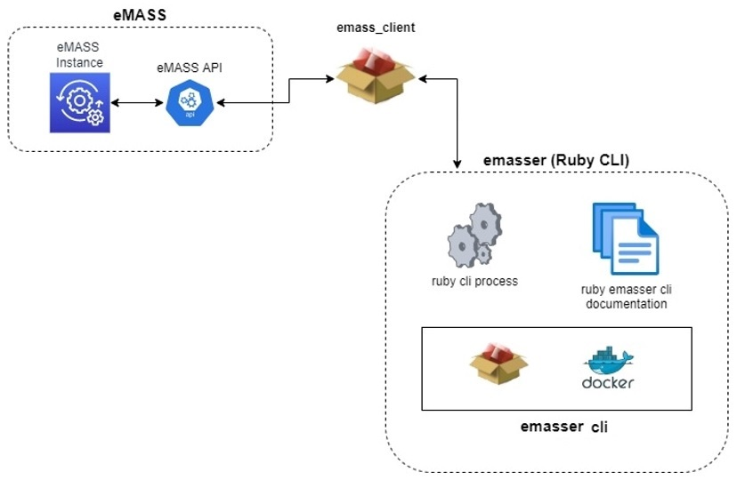

# emasser


[](https://badge.fury.io/rb/emasser)


## About

`emasser` is a Command Line Interface (CLI) that aims to automate routine business use-cases and provide utility surrounding the Enterprise Mission Assurance Support Service (eMASS) by leveraging its Representational State Transfer (REST) Application Programming Interface (API). 

---
## Documentation
For detail content information about the `eMASS` API references the [**eMASS API Specification**](https://mitre.github.io/emass_client/docs/redoc/) page.

For detail features provided bt the `emasser` CLI references the [**emasser CLI Features**](docs/features.md) page.

---
## Installation Options

`emasser` is a Ruby CLI distributed via GitHub (this repository), [RubyGems](https://rubygems.org/gems/emass_client/versions/), or [Docker](https://hub.docker.com/r/mitre/emasser/tags).

### Installation Dependencies
  * git
  * Ruby version 2.7 or greater.

### Runtime Dependencies
  * Ruby version 2.7 or greater.
  * `rubyzip (latest version)`
  * `emass_client (latest version)`
  * On Windows the `cURL` binary is required (libcurl.dll). To install cURL:
    - Download cURL for windows from [curl x.x.x for Windows](https://curl.se/windows/)
      - Go into the archive and browse to the /bin directory
      - Locate libcurl_x64.dll (it may be named just libcurl.dll)
      - Extract the file into the Ruby installation /bin directory
      - Rename the file to `libcurl.dll` if it has the `_x64` suffix
    - Install [cURL for windows](https://community.chocolatey.org/packages/curl) and add the installation directory to the PATH.


## Install via GitHub
- [Clone](https://docs.github.com/en/repositories/creating-and-managing-repositories/cloning-a-repository) the repository
  ```bash
  git clone <path to emasser repository> emasser
  cd emasser
  ```
- Build the emasser gem*
  ```bash
    gem build *.gemspec
    gem install *.gem
  ```
***Note:** To run in development mode there isn't a need to build the gem, simply clone from the emasser repository and use:
```
bundle install

bundle exec exe/emasser [command]
```
## Install via published RubyGems
- Just install the ```emasser``` gem from the [RubyGems](https://rubygems.org/gems/emass_client/versions/) registry
    ```bash
    gem install emasser
    ```
- To run (execute a command) create a `.env*` file in the directory where you want to invoke the `emmaser` and use: 
  
  ```
  emasser [command]
  ```
***Note:** See [Setting Environment Variables Configuration](https://github.com/mitre/emasser/wiki/Editing-Environment-Variables-Configuration) for detailed information on required and optional variables.

## Using Docker
Ensure that docker engine is running and start the emasser Docker Container.
- To run the emasser container use (other than windows):
  ```
  docker run --rm -v $PWD/path-to-secrets:/data mitre/emasser:latest
  ```
- To run the emasser container in a `Windows terminal (cmd)` use:
    ```
    docker run --rm -v %cd%/path-to-secrets:/data mitre/emasser:latest
    ```
**Notes:**
- Docker Options
  - `--rm` Automatically remove the container when it exits
  - `-v` Bind mount a volume
- path-to-secrets
  - Path to the `.env` file and the appropriate eMASS certificates (key. pem and client.pem).
  - For example, if the `.env` is located in the same directory where the `docker run` is executed, the command would look like this:
  
      ```
      docker run --rm -v %cd%/.:/data mitre/emasser:latest
      ```
  -  See [Editing Environment Variables Configuration](https://github.com/mitre/emasser/wiki/Editing-Environment-Variables-Configuration)

### Run emasser API client commands
- To list all available GET, POST, PUT, or DELETE commands use:
  ```
  docker run --rm -v $PWD/path-to-secrets:/data mitre/emasser:latest get help
  ```
  ```
  docker run --rm -v $PWD/path-to-secrets:/data mitre/emasser:latest post help
  ```
  ```
  docker run --rm -v $PWD/path-to-secrets:/data mitre/emasser:latest put help
  ```
  ```
  docker run --rm -v $PWD/path-to-secrets:/data mitre/emasser:latest delete help
  ```

### Delete (remove) the Docker Container
```
  docker rmi -f mitre/emasser
```
---
## Roadmap

Emasser implements all endpoints provided by the `eMASS` API, there is, all `HTTP` calls from the `eMASS GUI` to the `eMASS backend` that are exposed by the API.

The Road Map seeks to add any useful features that facilitates organization that utilizes  `eMASS` instances and have a need to automate their cybersecurity management process. 

For additional capability create an issue, and email (saf@groups.mitre.org) citing the issue link so we can help

Some proposed capabilities (looking for a sponsor) are:
* Update a system's record with met/not met NIST 800-53 Security and Privacy controls and/or common control indicators (CCI) based on scan results expressed in [Heimdall Data Format (HDF)](https://saf.mitre.org/#/normalize).
* Resolve a particular plan of action and milestone (POA&M) based on scan results or git-ops workflow.
* PKCS11 support to run in an attended mode.


## Design

### Interactions with eMASS API
`emasser` leverages a MITRE dependency, `emass_client`, which provides a REST API client based on a MITRE-created [OpenAPI](https://www.openapis.org/) version 3 specification for the official [eMASS API specification](https://mitre.github.io/emass_client/docs/redoc). This design enables REST API clients to be generated in [any supported programming language](https://openapi-generator.tech/docs/generators/). This design decision enables `emass_client` to generate a Ruby client for `emasser` and a TypeScript client that is included with [Security Automation Framework CLI (SAF) CLI](https://github.com/mitre/saf).

### Business Logic
Because interactions with the API are handled by a dependency, the bulk of `emasser` business logic is to accepting user input/output, reading data from eMASS or from input, transforming data, and routing data to the appropriate eMASS API endpoint. This business logic is organized into Ruby Classes and Modules based on the command or subcommand requested by the user.

## Emasser CLI Architecture
The `emasser` CLI implements the `emass_client` ruby gem to communicate with an `eMASS` instance via the `eMASS API` as depicted in the diagram below:
<div align="center">



</div>

### NOTICE

© 2020 The MITRE Corporation.

Approved for Public Release; Distribution Unlimited. Case Number 18-3678.

### NOTICE

MITRE hereby grants express written permission to use, reproduce, distribute, modify, and otherwise leverage this software to the extent permitted by the licensed terms provided in the LICENSE.md file included with this project.

### NOTICE

This software was produced for the U. S. Government under Contract Number HHSM-500-2012-00008I, and is subject to Federal Acquisition Regulation Clause 52.227-14, Rights in Data-General.

No other use other than that granted to the U. S. Government, or to those acting on behalf of the U. S. Government under that Clause is authorized without the express written permission of The MITRE Corporation.

For further information, please contact The MITRE Corporation, Contracts Management Office, 7515 Colshire Drive, McLean, VA  22102-7539, (703) 983-6000.
